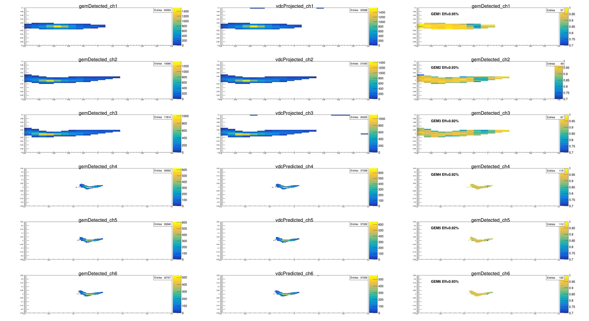
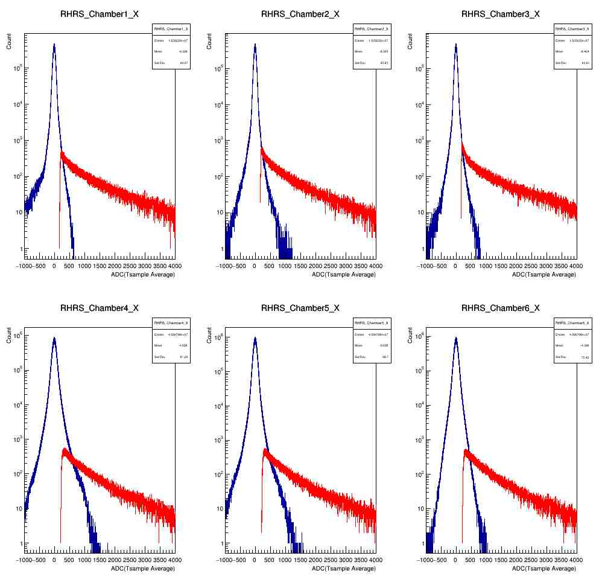
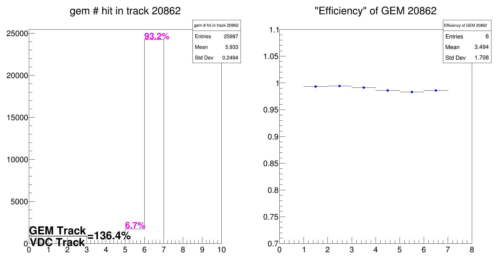

# GEM Performance Package 

## Get the GEM Pedestal Levels
```c++

```

## Get the GEM tracking efficiency reference to VDC
Get the GEM tracking efficiency reference to the vdc detectors. /
Input file need to be the output of the Podd Replayed root file.
```c++
gemVDCTrackEfficiency(fname)
```



## Get the GEM tracking efficiency reference to the other GEMs
```c++


```

## Get the vdc tracking efficiency with GEMs
Project the GEM detector back to the VDC and calculate the VDC tracking efficiency.
```c++

```


## Get the Signal vs. Noise Distribution 
```c++
gemNoiseSignalLevel()
```



## calculate the ratio of the GEM track and the VDC Track

```c++
vdcGEMTrackRatio(TSting fname)
```
